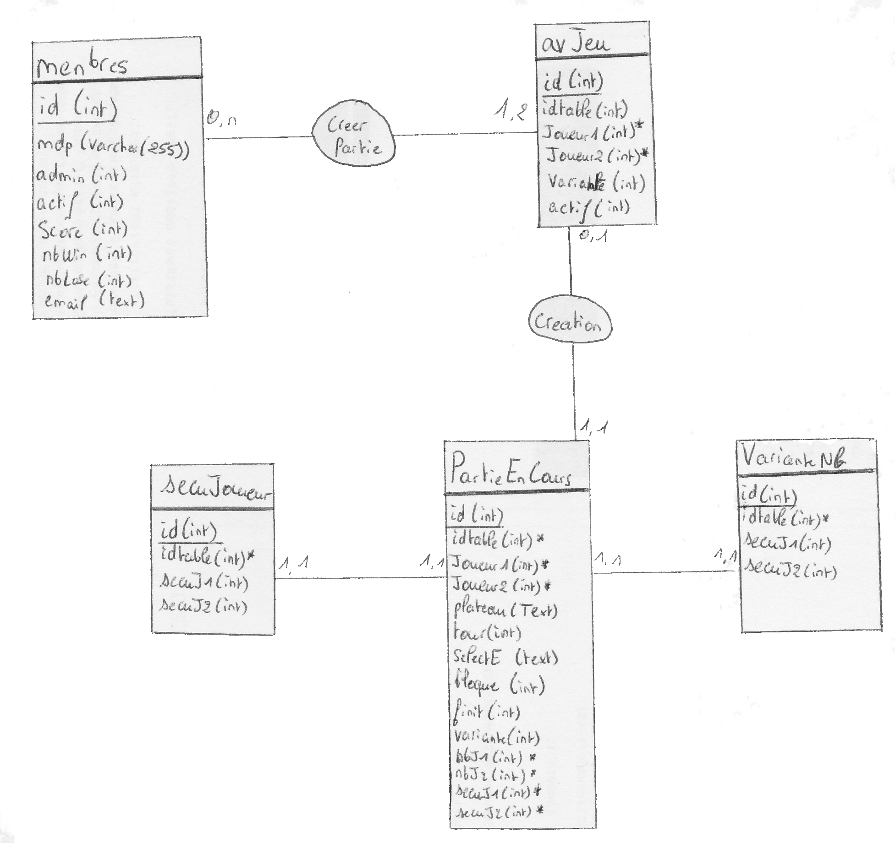
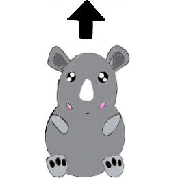

# Projet : Siam 2020 - Licence 3 - Informatique  
version du 22 mars 2020  

| Author         | Email          |
|----------------|----------------|
|`Bourdon Antoine-Alexis` |[mailto](mailto:antoine-alexis_bourdon@ens.univ-artois.fr) |
|`Devrainne Anthony`      |[mailto](****@****.fr) |

L'objectif est de créer un site web dynamique qui permet de créer, rejoindre et jouer des parties du jeu Siam.

## Les choix techniques

Pour les choix techniques l'application sera divisée en 3 parties:

    - Côté client : JavaScript et jquery + HTML5 + CSS (bootstrap, font-awesome.min). 
        * font-awesome.min : permet d'afficher des logos
    - La partie serveur : PHP7 et SQLite3

Les règles du jeu sont décrites dans ce [pdf](http://regle.jeuxsoc.fr/siam__rg.pdf).

## L'architecture choisie

Concernant le jeu nous sommes sur une architecture MVC (Modèle-Vue-Contrôleur).

+ Un modèle contient les données à afficher.
    + Le modèle est géré par la page [jeuInfo.php](jeu/jeuInfo.php).
+ Une vue contient la présentation de l'interface graphique.
    + La vue est gérée par les pages [plateau.php](jeu/plateau.php) et [ajaxJeu.js](jeu/js/ajaxJeu.js).
+ Un contrôleur contient la logique concernant les actions effectuées par l'utilisateur.
    + Le controleur est géré par la page [actionJeu.php](jeu/actionJeu.php).

#### Le modèle [jeuInfo.php](jeu/jeuInfo.php)

Contient les données à afficher.

La page [jeuInfo.php](jeu/jeuInfo.php) envoie les informations concernant une table de jeu (la représentation du plateau, joueur qui joue, la pièce sélectionnée, la pièce bouger par l'autre
joueur, les flèches à afficher et si la partie est finie)

#### Le vue [plateau.php](jeu/plateau.php) et [ajaxJeu.js](jeu/js/ajaxJeu.js)

[plateau.php](jeu/plateau.php) : Contient les tableaux (tables) du plateau et des joueurs. Contient les vérifications concernant l'existence de la table du plateau dans la BD.

[ajaxJeu.js](jeu/js/ajaxJeu.js) : Permets d'afficher tous les éléments graphiques dans le plateau et pour les tableaux des joueurs ainsi que les informations concernant les erreurs des joueurs
et qui doit jouer. 
Permet aussi de faire tout les envoie de données vers la page [jeuInfo.php](jeu/jeuInfo.php) et de récupérer les informations de la page [jeuInfo.php](jeu/jeuInfo.php).

#### Le controleur [actionJeu.php](jeu/actionJeu.php)

Contient la logique concernant les actions effectuées par l'utilisateur.
La page [actionJeu.php](jeu/actionJeu.php) reçoit les données qu'envoie l'utilisateur (envoie en POST et avec ajax).
Vérifie si l'utilisateur à le droit d'interagir avec le jeu. En effet si une personne envoie les informations concernant l'identifiant du joueur, le script à utiliser et l'élement à bouger;
Il ne pourra pas interagir avec le jeu s'il ne connaît pas le code de sécurité du joueur devant jouer.

_*Ce code de sécurité*_ et généré **aléatoirement** et increment de **1** à chaque insertion dans la base de données. 

## Schéma de la base de données

(Dans certains cas, une association binaire avec des cardinalité (1, 1) pour les deux entité est inutile, par exemple: secuJ1, secuJ2, nbJ1, nbJ2)

Voici le schéma de la base de données (ceci est une version temporaire) :

## Image du jeu

## Problème Possible
Si vous ne pouvez accéder au site avec Apache, supprimer .htaccess .
